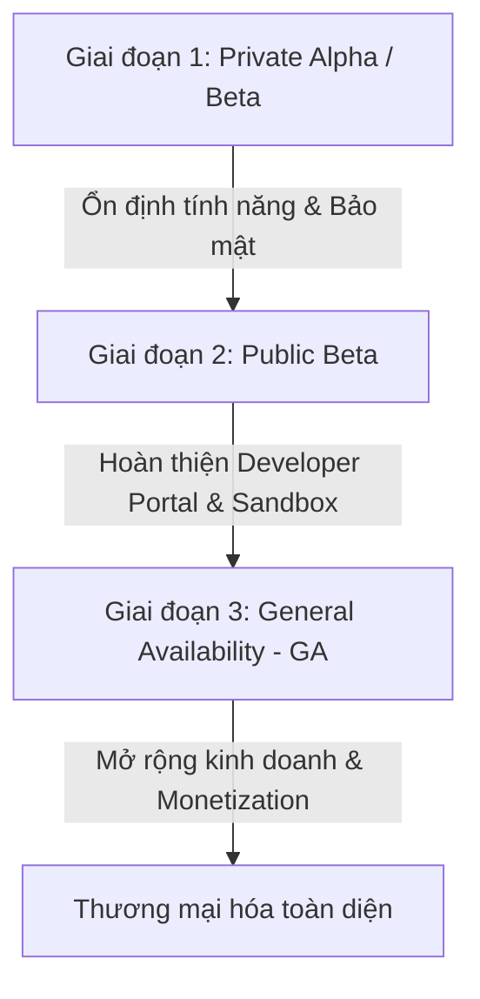

# CHIẾN LƯỢC RA MẮT VÀ MÔ HÌNH KIẾM TIỀN TỪ API (HW12)
**Dự án: AI E-Commerce API Suite (Hệ thống API Thương mại Điện tử Tích hợp AI)**

---

## PHẦN 1: CHIẾN LƯỢC RA MẮT API (API LAUNCH STRATEGY)

Chiến lược ra mắt một API thành công đòi hỏi sự cân bằng giữa phát triển kỹ thuật, tối ưu hóa trải nghiệm nhà phát triển (Developer Experience - DX) và định hướng kinh doanh. Chúng tôi đề xuất mô hình ra mắt gồm **3 Giai đoạn chính (Phased Rollout)** nhằm kiểm soát rủi ro và thu thập phản hồi hiệu quả.

### 1.1. Các Giai Đoạn Ra Mắt (Launch Phases)

#### Giai đoạn 1: Private Alpha / Closed Beta (Thử nghiệm hạn chế)
*   **Mục tiêu:** Kiểm tra độ ổn định cốt lõi của API, hiệu năng chịu tải (performance) và các lỗ hổng bảo mật cơ bản với một nhóm nhỏ đối tác chiến lược hoặc lập trình viên nội bộ (10 - 20 developers).
*   **Hành động chính:**
    *   Cung cấp API Key thủ công qua email hoặc kênh liên lạc riêng.
    *   Hỗ trợ kỹ thuật trực tiếp (high-touch support) 1-1 để nhanh chóng vá lỗi.
    *   Tập trung thu thập phản hồi về thiết kế Schema, tính trực quan của các Endpoint và tính hữu dụng của dữ liệu trả về.
*   **Hạ tầng:** Chạy trên môi trường Staging nội bộ, giới hạn Rate-limiting ở mức thấp để tránh quá tải.

#### Giai đoạn 2: Public Beta (Thử nghiệm cộng đồng)
*   **Mục tiêu:** Mở rộng tệp người dùng để kiểm thử khả năng chịu tải trên diện rộng, đánh giá hiệu quả của hệ thống tự phục vụ (Self-service) và hoàn thiện tài liệu hướng dẫn.
*   **Hành động chính:**
    *   Ra mắt **Developer Portal** phiên bản Beta cho phép đăng ký tài khoản tự động và tự cấp phát API Key.
    *   Cung cấp môi trường **Sandbox** hoàn chỉnh với Mock data trực quan.
    *   Công khai tài liệu API (API Docs) tích hợp công cụ test trực tiếp (interactive playground).
    *   Thành lập kênh hỗ trợ cộng đồng (Discord, Slack hoặc GitHub Discussions) để gom góp ý kiến của cộng đồng dev.
*   **Hạ tầng:** Triển khai cơ chế Rate-limiting tự động (ví dụ: tối đa 60 requests/phút trên mỗi API Key) để bảo vệ hệ thống.

#### Giai đoạn 3: General Availability - GA (Ra mắt chính thức)
*   **Mục tiêu:** Thương mại hóa dịch vụ API với độ tin cậy tối đa, cam kết chất lượng dịch vụ (SLA) và tích hợp cổng thanh toán.
*   **Hành động chính:**
    *   Kích hoạt hệ thống thanh toán tự động, tích hợp các gói cước thương mại.
    *   Cam kết SLA rõ ràng (ví dụ: Uptime 99.9%, thời gian phản hồi trung bình < 100ms).
    *   Cung cấp bảng điều khiển (Developer Dashboard) hiển thị biểu đồ phân tích tần suất gọi API, tỷ lệ lỗi, và hóa đơn thời gian thực.
    *   Cung cấp các bộ SDK chính thức cho các ngôn ngữ phổ biến (Node.js, Python, Go).

---

### 1.2. Ba Trụ Cột Kỹ Thuật Cho Trải Nghiệm Nhà Phát Triển (DX)

#### Trụ cột 1: Developer Portal (Cổng thông tin nhà phát triển)
Developer Portal đóng vai trò là "mặt tiền" của sản phẩm API. Một Portal tốt cần đảm bảo:
*   **Self-service Smooth Onboarding:** Nhà phát triển chỉ mất dưới 2 phút để đăng ký, xác thực email và lấy được API Key đầu tiên.
*   **Developer Dashboard trực quan:** Xem được báo cáo dung lượng sử dụng, cấu hình Webhooks, quản lý API Keys (Re-roll, revoke) và thông tin thanh toán.
*   **Status Page tích hợp:** Hiển thị trạng thái hoạt động trực thời (Real-time Uptime) của từng dịch vụ API.

#### Trụ cột 2: API Documentation (Tài liệu API tương tác)
Tài liệu cần cấu trúc theo phong cách hiện đại (như Stripe hoặc ReadMe):
*   **Layout 3 cột thông minh:** Cột 1 là danh mục & khái niệm; Cột 2 là chi tiết Endpoint (HTTP Method, Path, Params, Headers); Cột 3 là Code Snippet tương ứng (cURL, JS, Python) và JSON Response mẫu.
*   **Mô tả rõ ràng:** Chi tiết kiểu dữ liệu, các ràng buộc đầu vào (validation rules) và toàn bộ bảng mã lỗi (Error Codes) có kèm giải pháp khắc phục.
*   **Version Control:** Cho phép chuyển đổi linh hoạt giữa các phiên bản API (ví dụ: `v1` vs `v2`) để tránh xung đột hệ thống kế thừa.

#### Trụ cột 3: API Sandbox (Môi trường giả lập)
Sandbox là môi trường an toàn tuyệt đối để lập trình viên thử nghiệm mà không sợ làm ảnh hưởng tới dữ liệu thật hay phát sinh chi phí giao dịch.
*   **Data Isolation:** Cơ sở dữ liệu Sandbox hoàn toàn độc lập với Production. Dữ liệu giao dịch, đơn hàng, khách hàng đều là giả lập (Mock data).
*   **Simulation Suite:** Hỗ trợ mô phỏng các kịch bản lỗi (ví dụ: truyền Header `X-Simulate-Error: 500` để giả lập lỗi hệ thống, hoặc nhập số thẻ tín dụng thử nghiệm để test cổng thanh toán).
*   **Zero-cost Testing:** Mọi cuộc gọi vào Sandbox đều hoàn toàn miễn phí và có giới hạn Rate-limit riêng rộng rãi để kiểm thử tính năng.

---

## PHẦN 2: ĐỀ XUẤT MÔ HÌNH KIẾM TIỀN (API MONETIZATION MODELS)

Chúng tôi phân tích hai mô hình kiếm tiền phổ biến và đề xuất giải pháp tối ưu cho sản phẩm **AI E-Commerce API**.

### 2.1. Phân Tích Các Mô Hình

#### 1. Mô hình Freemium
Cung cấp một lượng tài nguyên API miễn phí giới hạn mỗi tháng, yêu cầu nâng cấp lên gói trả phí khi vượt quá hạn mức hoặc khi cần các tính năng nâng cao.
*   **Cách áp dụng:** Cung cấp miễn phí **1,000 requests/tháng** đối với các API cơ bản (như tìm kiếm sản phẩm thông thường). Không kèm hỗ trợ kỹ thuật cam kết hay SLA.
*   **Ưu điểm:**
    *   **Tạo phễu khách hàng cực lớn:** Giảm thiểu tối đa rào cản gia nhập (low friction). Lập trình viên dễ dàng tích hợp thử và chứng minh giá trị API trước khi xin ngân sách từ công ty.
    *   **Marketing truyền miệng (Word-of-mouth):** Lập trình viên yêu thích công cụ miễn phí sẽ giới thiệu cho đồng nghiệp.
*   **Nhược điểm:**
    *   **Chi phí vận hành cao:** Phải chịu tải cho lượng lớn người dùng miễn phí không sinh ra doanh thu.
    *   **Nguy cơ lạm dụng (Abuse/Spam):** Người dùng cố tình tạo nhiều tài khoản ảo để lợi dụng gói miễn phí. Đòi hỏi hệ thống phòng chống gian lận phức tạp.

#### 2. Mô hình Pay-per-call (Pay-as-you-go - Trả theo lượt gọi)
Tính phí dựa trên chính xác số lượng request mà nhà phát triển đã thực hiện trong chu kỳ thanh toán.
*   **Cách áp dụng:** Tính phí cố định, ví dụ **$0.001 cho mỗi request thành công** gửi tới hệ thống. Cuối tháng cộng dồn hóa đơn.
*   **Ưu điểm:**
    *   **Doanh thu phản ánh đúng chi phí hạ tầng:** Giúp công ty luôn duy trì tỷ suất lợi nhuận gộp dương, đặc biệt là với các API AI vốn tốn rất nhiều tài nguyên phần cứng (GPU/LLM Tokens).
    *   **Không giới hạn quy mô:** Phù hợp tuyệt đối với các khách hàng doanh nghiệp lớn tăng trưởng nhanh. Họ dùng nhiều trả nhiều, dùng ít trả ít, không lo bị nghẽn do hết hạn mức gói.
*   **Nhược điểm:**
    *   **Khó dự toán ngân sách:** Các bộ phận tài chính của khách hàng doanh nghiệp thường không thích chi phí biến động vô định hình hàng tháng.
    *   **Tâm lý e ngại tích hợp:** Lập trình viên sợ việc code lỗi tạo vòng lặp vô hạn (infinite loop) làm phát sinh hóa đơn khổng lồ chỉ sau một đêm.

---

### 2.2. Đề Xuất Mô Hình Tối Ưu: Gói Cước Lai (Hybrid Tiered Pay-as-you-go)

Để dung hòa ưu điểm của cả hai mô hình trên, chúng tôi đề xuất **Mô hình Lai chia Gói dịch vụ kết hợp Phí vượt gói (Hybrid Subscription + Overage Pay-per-call)**. Đây cũng là mô hình thành công nhất đang được các ông lớn công nghệ như Stripe, Twilio hay OpenAI áp dụng.

| Gói cước | Chi phí cố định | Hạn mức bao gồm | Giá cước vượt hạn mức (Pay-per-call) | Mục tiêu khách hàng |
| :--- | :--- | :--- | :--- | :--- |
| **Sandbox / Free** | **$0** / tháng | 1,000 requests | Không hỗ trợ gọi thêm (Bị khóa khi hết) | Cá nhân học tập, nghiên cứu và phát triển thử nghiệm |
| **Developer** | **$29** / tháng | 50,000 requests | **$0.001** / mỗi request vượt gói | Startup nhỏ, các ứng dụng thương mại điện tử quy mô vừa |
| **Scale-up** | **$149** / tháng | 300,000 requests | **$0.0006** / mỗi request vượt gói | Doanh nghiệp bán lẻ tăng trưởng nhanh, tải cao |
| **Enterprise** | **Tùy chỉnh (Custom)** | Không giới hạn | Thương lượng riêng (Ví dụ: **$0.0003**/request) | Tập đoàn lớn cần SLA 99.99%, hỗ trợ kỹ thuật 24/7/365 |

#### Tại sao mô hình này tối ưu nhất cho AI E-Commerce API?
1.  **Gói Free** đóng vai trò thu hút cộng đồng và truyền thông, nhưng giới hạn ở 1,000 requests để khống chế chi phí hạ tầng AI (GPU).
2.  **Phí cố định hàng tháng (Subscription)** giúp công ty có doanh thu dự đoán được (Predictable Revenue) để duy trì máy chủ định kỳ.
3.  **Phí vượt gói (Pay-per-call overage)** bảo vệ hệ thống không bị lỗ khi khách hàng bùng nổ lượng truy cập đột biến, đồng thời tạo cơ hội tăng doanh thu tự động mà không cần ép khách nâng gói lớn.
4.  **Cơ chế cảnh báo chi phí:** Hệ thống sẽ cho phép nhà phát triển thiết lập **Hard Limit** và **Soft Limit** trong dashboard. Khi chi phí vượt ngưỡng mềm, hệ thống gửi email cảnh báo; khi chạm ngưỡng cứng, hệ thống tạm dừng nhận request để tránh hóa đơn "trên trời" ngoài ý muốn của khách hàng.

---

## PHẦN 3: HIỆN THỰC HÓA BẰNG THỰC HÀNH (DEVELOPER PORTAL PROTOTYPE)

Để minh họa sống động cho các đề xuất chiến lược trên, chúng tôi tiến hành xây dựng một **Developer Portal mẫu tương tác hoàn chỉnh** tại thư mục `HW12/` với các tính năng:
*   Trang chủ trực quan giới thiệu các dịch vụ AI E-Commerce API.
*   **Sandbox Playground:** Cho phép gõ thử từ khóa tìm kiếm hoặc giả lập đơn hàng và nhận kết quả JSON trả về ngay lập tức với hiệu ứng load dữ liệu mượt mà.
*   **Interactive API Docs:** Cấu trúc layout 2 cột hiện đại, chứa các endpoint chính xác và mã code ví dụ (cURL, Python, JS).
*   **Interactive Calculator:** Bộ công cụ trượt trực quan giúp khách hàng kéo số lượng request mong muốn để tự động tính toán chi phí hàng tháng tối ưu theo mô hình đề xuất.
